<div align="center">

# 🏫 SIAKAD — Sistem Informasi Akademik Sekolah

> **Aplikasi manajemen absensi & akademik sekolah berbasis web** yang dibangun dengan **Laravel 12** (Backend) dan **React + Vite** (Frontend)

[](https://laravel.com)
[](https://react.dev)
[](https://vite.dev)
[](https://tailwindcss.com)
[](https://php.net)
[](https://mysql.com)
[](LICENSE)

</div>

## 📌 Tentang Proyek

**SIAKAD** adalah sistem informasi akademik berbasis web yang dirancang untuk membantu sekolah dalam mengelola kehadiran siswa, data akademik, pengumuman, dan komunikasi antar pemangku kepentingan. Sistem ini mendukung **multi-role** (Operator, Guru, Kepala Sekolah, dan Orang Tua) dengan dashboard dan hak akses yang berbeda untuk setiap peran.

### 🎯 Tujuan Sistem

| No | Tujuan |
|----|--------|
| 1  | Mempermudah guru dalam melakukan absensi harian per mata pelajaran |
| 2  | Memberikan transparansi kehadiran siswa kepada orang tua secara real-time |
| 3  | Memudahkan kepala sekolah dalam memonitor data akademik sekolah |
| 4  | Menyederhanakan pengelolaan data master (siswa, guru, kelas, jadwal) oleh operator |

---

## ✨ Fitur Utama

### 👨‍💼 Operator
- Manajemen akun pengguna (guru, siswa, orang tua, kepala sekolah)
- Master data kelas, mata pelajaran, dan jadwal pelajaran
- Manajemen tahun ajaran & proses naik kelas
- Approval pendaftaran akun orang tua
- Pengelolaan galeri & pengumuman sekolah

### 👨‍🏫 Guru
- Dashboard statistik kelas
- Input absensi per jadwal pelajaran
- Rekap absensi siswa dengan ekspor PDF/Excel
- Lihat data siswa dan riwayat absensi
- Lihat jadwal mengajar

### 🎓 Kepala Sekolah
- Dashboard monitoring statistik sekolah
- Monitoring absensi seluruh kelas
- Melihat data guru & siswa
- Manajemen pengumuman & kalender akademik

### 👨‍👩‍👧 Orang Tua
- Pantau absensi anak secara real-time
- Riwayat absensi per bulan
- Tambah & kelola data anak
- Lihat pengumuman sekolah

---

## 🛠 Teknologi

### Backend
| Teknologi | Versi | Fungsi |
|-----------|-------|--------|
| PHP | 8.2+ | Runtime language |
| Laravel | 12.x | Web framework |
| Laravel Sanctum | 4.3 | API Authentication (Token-based) |
| MySQL | 8.x | Database utama |

### Frontend
| Teknologi | Versi | Fungsi |
|-----------|-------|--------|
| React | 19.x | UI Library |
| Vite | 8.x | Build tool & dev server |
| TailwindCSS | 4.x | Utility-first CSS framework |
| React Router DOM | 7.x | Client-side routing |
| TanStack Query | 5.x | Server state management & caching |
| Axios | 1.x | HTTP client |
| Recharts | 3.x | Charting library |
| jsPDF + AutoTable | 4.x + 5.x | Ekspor laporan PDF |
| XLSX | 0.18 | Ekspor laporan Excel |
| Lucide React | 1.x | Icon library |
| React Hot Toast | 2.x | Notifikasi |

---
---

## 📊 Analisis Proses Bisnis

### Flowchart Sistem Berjalan (Manual)

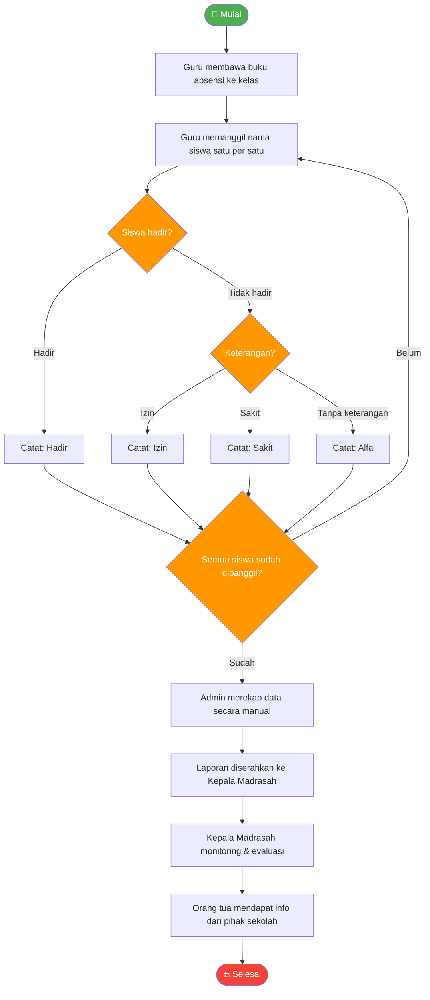

---

## 🗂️ Perancangan Sistem

### Use Case Diagram

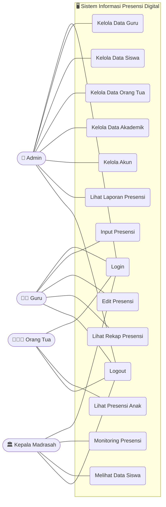

---

### Activity Diagram

#### 1. Login — Semua Aktor

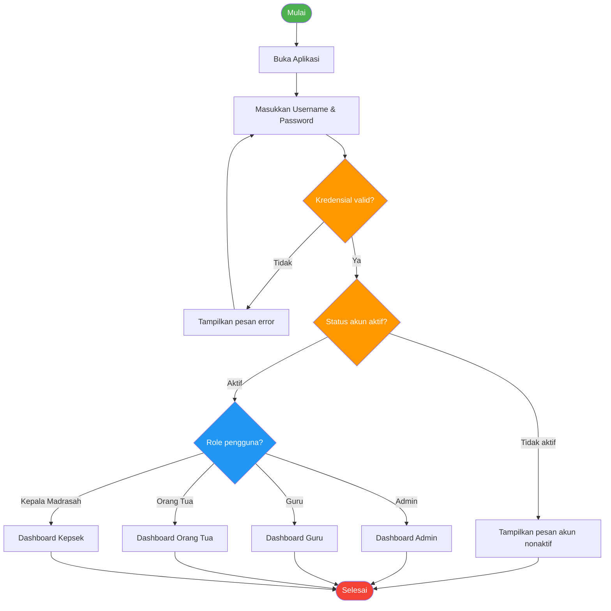

#### 2. Kelola Data — Admin

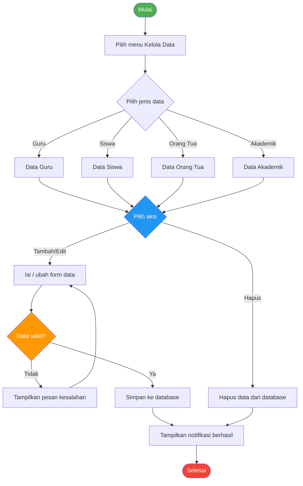

#### 3. Input Presensi — Guru

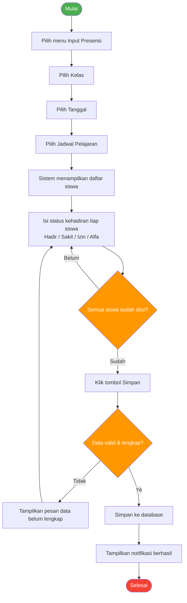

#### 4. Monitoring Presensi — Kepala Madrasah

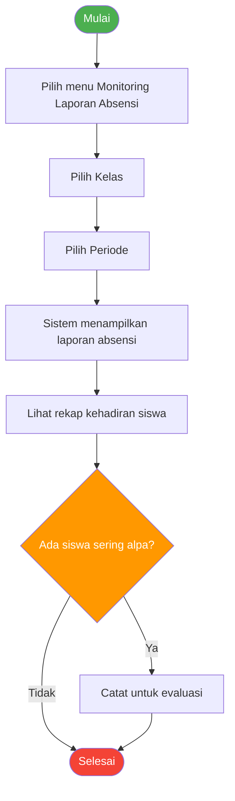

#### 5. Lihat Presensi Anak — Orang Tua

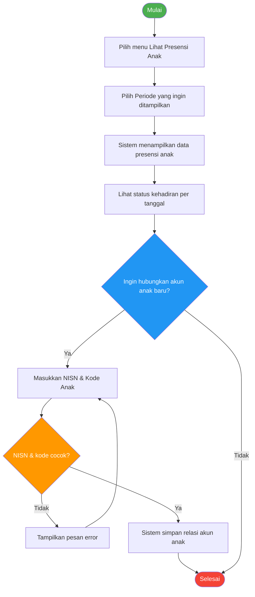

---

### Sequence Diagram

#### 1. Kelola Data — Admin

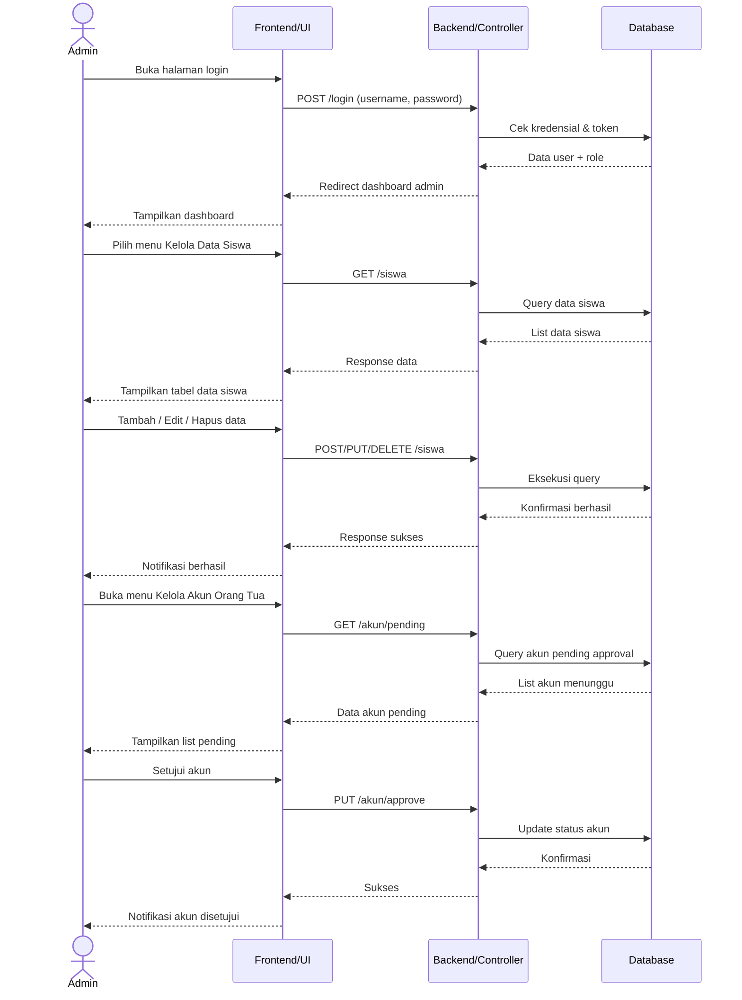

#### 2. Input Absensi Siswa — Guru

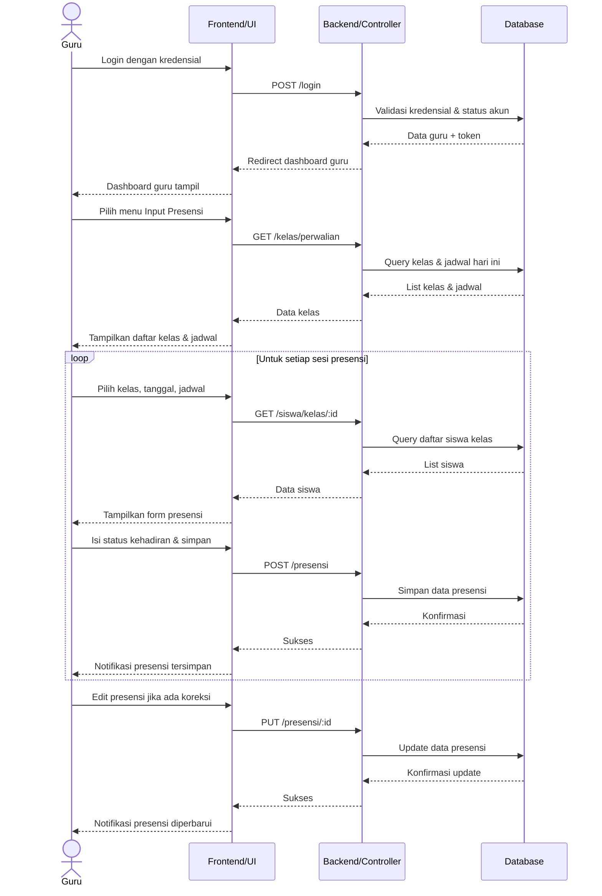

#### 3. Monitoring Laporan — Kepala Madrasah

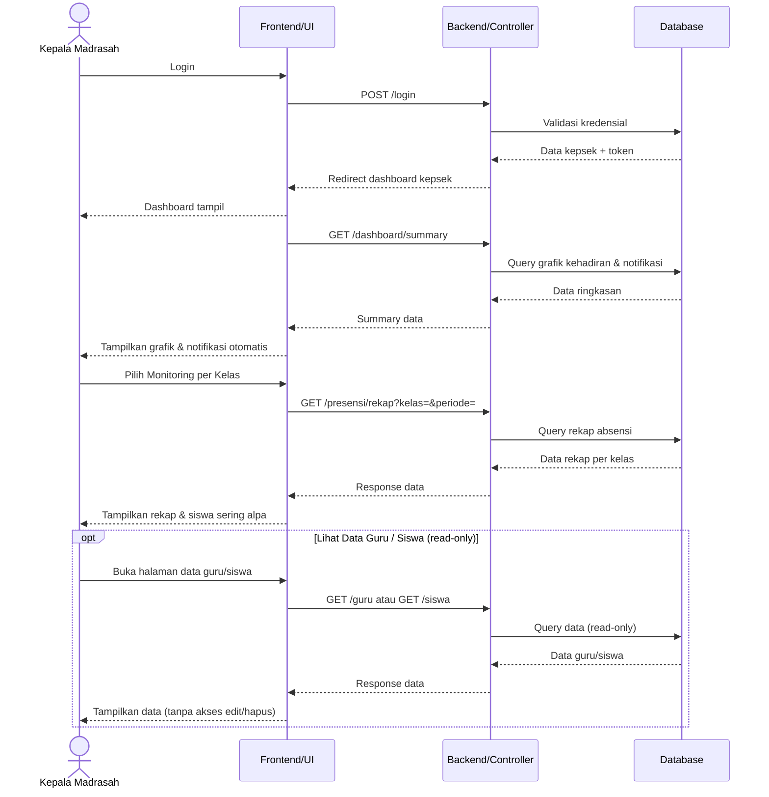

#### 4. Lihat Absensi Anak — Orang Tua

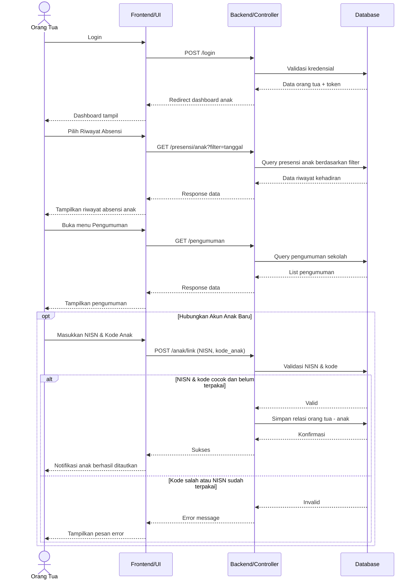

---

### Class Diagram

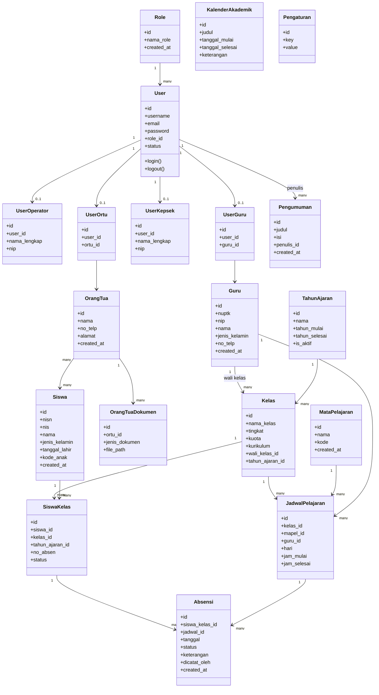

---

## ⚙️ Metode Pengembangan

Sistem dikembangkan menggunakan **metode Waterfall** — terstruktur dan bertahap, cocok karena kebutuhan sistem sudah ditentukan sejak awal.

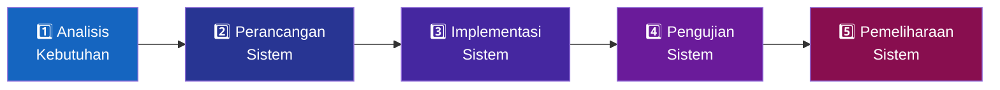

| Tahap | Keterangan |
|-------|-----------|
| **1. Analisis** | Identifikasi kebutuhan: kelola data guru, siswa, orang tua, input presensi, monitoring, akses orang tua |
| **2. Perancangan** | Use Case, Activity, Sequence, Class Diagram + rancangan antarmuka |
| **3. Implementasi** | Pembangunan aplikasi web (Laravel + React + MySQL) |
| **4. Pengujian** | Black Box Testing pada seluruh fitur utama |
| **5. Pemeliharaan** | Perbaikan bug & pengembangan fitur ke depan |

---

## 🧪 Pengujian Sistem

Metode pengujian: **Black Box Testing** — fokus pada fungsionalitas dari sisi pengguna.

### Flow Graph — Login

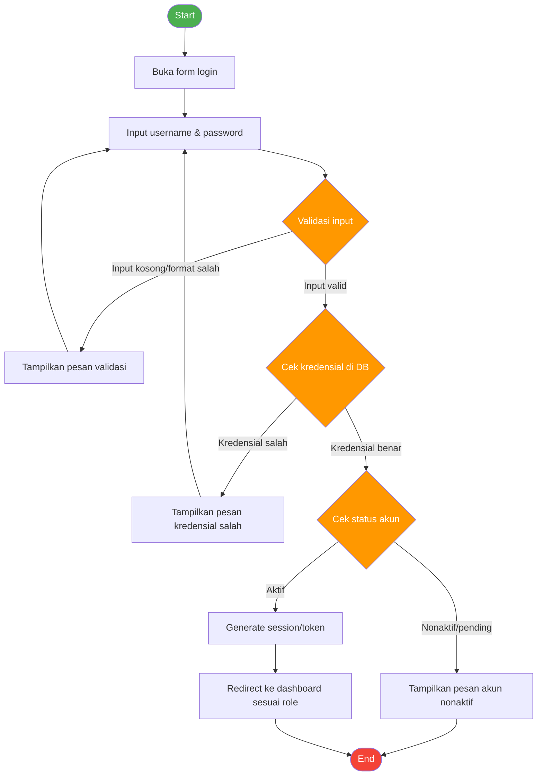

### Flow Graph — Input Presensi

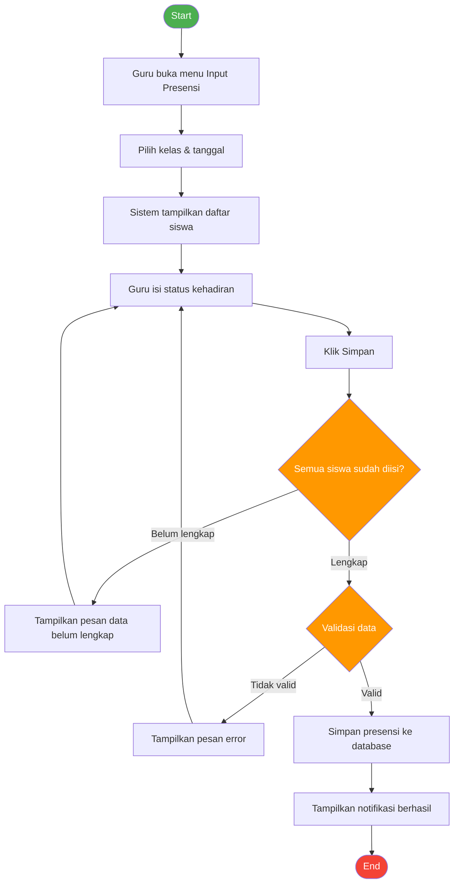

### Hasil Black Box Testing

| # | Fitur | Skenario | Hasil yang Diharapkan | Status |
|---|-------|----------|-----------------------|--------|
| 1 | Login | Input username & password valid | Masuk ke dashboard sesuai role | ✅ Valid |
| 2 | Login | Input username/password salah | Muncul pesan "kredensial salah" | ✅ Valid |
| 3 | Login | Akun belum diapprove/nonaktif | Muncul pesan "akun nonaktif" | ✅ Valid |
| 4 | Kelola Data Guru | Admin tambah data guru lengkap | Data guru berhasil disimpan | ✅ Valid |
| 5 | Kelola Data Guru | Admin kosongkan field wajib | Sistem tampilkan pesan data belum lengkap | ✅ Valid |
| 6 | Kelola Data Siswa | Admin ubah data siswa | Perubahan data berhasil disimpan | ✅ Valid |
| 7 | Kelola Data Orang Tua | Admin hapus data orang tua | Data berhasil dihapus dari sistem | ✅ Valid |
| 8 | Input Presensi | Guru isi semua status & simpan | Data presensi berhasil disimpan | ✅ Valid |
| 9 | Input Presensi | Guru belum isi semua status | Sistem tampilkan pesan data belum lengkap | ✅ Valid |
| 10 | Monitoring Presensi | Kepsek buka halaman monitoring | Sistem tampilkan data presensi seluruh siswa | ✅ Valid |
| 11 | Lihat Presensi Anak | Orang tua buka data presensi anak | Sistem tampilkan riwayat kehadiran anak | ✅ Valid |

> 🎉 **Seluruh 11 fitur utama** dinyatakan berfungsi dengan baik sesuai kebutuhan fungsional sistem.

---

## ✨ Fitur Utama

- 🔐 **Autentikasi berbasis role** — Admin, Guru, Kepala Madrasah, Orang Tua
- 📝 **Input & edit presensi** oleh guru secara digital (Hadir / Sakit / Izin / Alfa)
- 📊 **Dashboard monitoring** dengan grafik & rekap kehadiran per kelas
- 👨‍👩‍👧 **Portal orang tua** — pantau kehadiran anak secara real-time + filter tanggal
- 🔗 **Link akun anak** via NISN + kode unik siswa (`kode_anak`)
- 📢 **Pengumuman sekolah** & **kalender akademik**
- 🗄️ **Pengelolaan data lengkap** — guru, siswa, orang tua, kelas, jadwal, tahun ajaran

---

<div align="center">

**MI Nurul Huda 3** — Kp. Kencana, RT 01/RW 02, Kel. Kencana, Kec. Tanah Sareal, Kota Bogor

*Rekayasa Perangkat Lunak — Teknik Informatika 4.B.1*

</div>


## 📁 Struktur Proyek

```
Tugas_UAS_RPL_1/
│
├── 📂 backend/                     # Laravel 12 API
│   ├── 📂 app/
│   │   ├── 📂 Http/Controllers/
│   │   │   ├── 📂 Absensi/         # AbsensiController
│   │   │   ├── 📂 Auth/            # AuthController
│   │   │   ├── 📂 Guru/            # GuruController
│   │   │   ├── 📂 Kepsek/          # KepsekController
│   │   │   ├── 📂 MasterData/      # Data master
│   │   │   ├── 📂 Operator/        # OperatorController
│   │   │   ├── 📂 Ortu/            # OrtuController
│   │   │   ├── GaleriController.php
│   │   │   └── PengumumanController.php
│   │   └── 📂 Models/
│   │       ├── Absensi.php
│   │       ├── Guru.php
│   │       ├── JadwalPelajaran.php
│   │       ├── Kelas.php
│   │       ├── MataPelajaran.php
│   │       ├── OrangTua.php
│   │       ├── Pengumuman.php
│   │       ├── Siswa.php
│   │       ├── SiswaKelas.php
│   │       ├── TahunAjaran.php
│   │       └── User.php
│   ├── 📂 database/migrations/
│   └── 📂 routes/
│
└── 📂 frontend/                    # React + Vite SPA
    └── 📂 src/
        ├── 📂 pages/
        │   ├── 📂 operator/        # Halaman Operator
        │   ├── 📂 guru/            # Halaman Guru
        │   ├── 📂 kepsek/          # Halaman Kepala Sekolah
        │   ├── 📂 ortu/            # Halaman Orang Tua
        │   ├── 📂 auth/            # Login dan Register
        │   └── 📂 public/          # Gallery, About, Contact
        ├── 📂 components/          # Reusable components
        ├── 📂 contexts/            # React Context AuthContext
        ├── 📂 hooks/               # Custom hooks
        ├── 📂 routes/              # ProtectedRoute component
        └── App.jsx                 # Root routing
```

---

## 🚀 Instalasi & Menjalankan

### Prasyarat

- PHP >= 8.2
- Composer
- Node.js >= 18.x & npm
- MySQL 8.x

### 1. Clone Repository

```bash
git clone https://github.com/username/Tugas_UAS_RPL_1.git
cd Tugas_UAS_RPL_1
```

### 2. Setup Backend (Laravel)

```bash
cd backend

# Install dependencies
composer install

# Copy file environment
cp .env.example .env

# Generate application key
php artisan key:generate

# Konfigurasi database di .env
# DB_DATABASE=siakad
# DB_USERNAME=root
# DB_PASSWORD=

# Jalankan migrasi database
php artisan migrate

# (Opsional) Jalankan seeder
php artisan db:seed

# Jalankan server backend
php artisan serve
```

### 3. Setup Frontend (React)

```bash
cd frontend

# Install dependencies
npm install

# Copy file environment
cp .env.example .env

# Konfigurasi URL API di .env
# VITE_API_URL=http://localhost:8000/api

# Jalankan dev server
npm run dev
```

### 4. Akses Aplikasi

| Layanan | URL |
|---------|-----|
| Frontend | `http://localhost:5173` |
| Backend API | `http://localhost:8000` |

---

## 🔌 API Endpoints

### Authentication

| Method | Endpoint | Deskripsi |
|--------|----------|-----------|
| `POST` | `/api/login` | Login pengguna |
| `POST` | `/api/logout` | Logout pengguna |
| `POST` | `/api/register-ortu` | Registrasi akun orang tua |

### Absensi (Guru)

| Method | Endpoint | Deskripsi |
|--------|----------|-----------|
| `GET` | `/api/absensi/jadwal/{id_kelas}` | Jadwal hari ini |
| `GET` | `/api/absensi/kelas/{id_kelas}` | Daftar siswa + status absensi |
| `POST` | `/api/absensi/store` | Submit absensi |
| `PUT` | `/api/absensi/{id}` | Edit absensi satu siswa |
| `GET` | `/api/absensi/rekap/{id_kelas}` | Rekap absensi per kelas |

### Master Data (Operator)

| Method | Endpoint | Deskripsi |
|--------|----------|-----------|
| `GET/POST` | `/api/guru` | List & tambah guru |
| `GET/PUT/DELETE` | `/api/guru/{nuptk}` | Detail, edit, hapus guru |
| `GET/POST` | `/api/siswa` | List & tambah siswa |
| `GET/PUT/DELETE` | `/api/siswa/{nisn}` | Detail, edit, hapus siswa |
| `GET/POST` | `/api/kelas` | List & tambah kelas |
| `GET/POST` | `/api/jadwal-pelajaran` | List & tambah jadwal |

### Orang Tua

| Method | Endpoint | Deskripsi |
|--------|----------|-----------|
| `GET` | `/api/ortu/anak` | Daftar anak yang terdaftar |
| `GET` | `/api/absensi/siswa/{nisn}` | Riwayat absensi anak |

---


## 👥 Kelompok 1 — UAS Rekayasa Perangkat Lunak

| No | Nama | NIM | Peran |
|----|------|-----|-------|
| 1 | Muhammad Sahal Anwar Hadi | 24260032 | Backend, Flowchart, Waterfall |
| 2 | Shela Rahma Fitri | 24260012 | Database, Use Case, Activity Diagram |
| 3 | Abin Maulana Aksa | 24260029 | Pengujian Sistem, Black Box Testing |
| 4 | Muhamad Khoerul | 24260049 | Frontend, Class Diagram, Sequence Diagram |

> **Prodi:** Teknik Informatika &nbsp;|&nbsp; **Kelas:** 4.B.1 &nbsp;|&nbsp; **Mata Kuliah:** Rekayasa Perangkat Lunak


---

<div align="center">

**⭐ Jika proyek ini membantu, jangan lupa berikan bintang! ⭐**

---

*Dibuat dengan ❤️ menggunakan Laravel & React*

</div>
